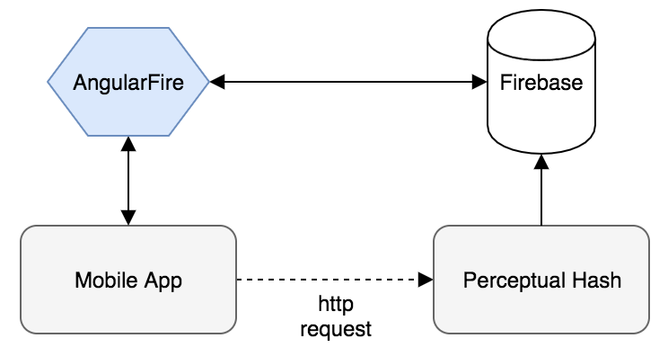

# Houblonde

> **Note :** Le projet est actuellement mis de côté, toute les sources sont disponible dans ce répertoire.

Application mobile communautaire pour les passionés de bières !

## L'idée

Lorsqu'on goûte une bonne bière, j'ai remarqué que souvent on prend la bouteille en photo pour le souvenir, mais la photo a tendance à se perdre parmis tant d'autre dans notre téléphone. L'idée derrière ce projet était donc de garder facilement une trace de ses dégustations pour les amateurs de bières.

## Développement

Ce projet est composé des parties suivantes :
- Front-end : Application mobile, **Ionic & Angular 1**
- Back-end : REST API (Hachage perceptuel), **Node.js, Express**
- Database : NoSQL Cloud, **Firebase**

## Organisation

   
  <i>Diagramme d'organisation</i>

